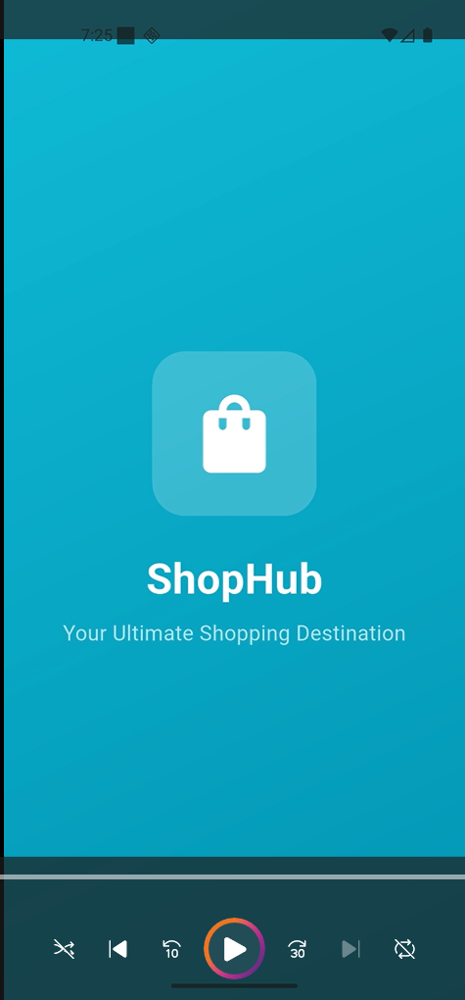

# 🛒 ShopSphere – Full-Stack E-Commerce Platform

A scalable and feature-rich **full-stack e-commerce application** built using **Flutter (Clean Architecture + BLoC)** and **Node.js + Express + MongoDB**.

ShopSphere provides a complete online shopping experience with **authentication, admin dashboard, order management, checkout flow, and modern UI architecture**.

* * *

## Demo Video

## 📌 Table of Contents

*   [Features](#features)
    
*   Tech Stack
    
*   Architecture
    
*   [Project Structure](#project-structure)
    
*   [Installation](#installation)
    
*   [Running the Application](#running-the-application)
    
*   [API Endpoints](#api-endpoints)
    
*   Future Improvements
    
*   [Contributing](#contributing)
    
*   [License](#license)
    

* * *

## 🚀 Features

### 👤 User Features

*   User Authentication (Login / Signup)
    
*   Browse Products by Category
    
*   Search Products
    
*   Product Details & Reviews
    
*   Add to Cart / Wishlist
    
*   Checkout Flow (Address → Payment → Review)
    
*   Order History & Tracking
    
*   Profile Management
    

* * *

### 🛠️ Admin Features

*   Admin Dashboard
    
*   Add / Edit / Delete Products
    
*   Inventory Management
    
*   View Orders
    
*   Best Selling Products
    
*   Low Inventory Alerts
    

* * *

### ⚙️ Core Features

*   Clean Architecture (Flutter)
    
*   BLoC State Management
    
*   REST API Integration
    
*   Modular & Scalable Codebase
    
*   Persistent Auth Storage
    
*   Optimized UI & Navigation
    

* * *

## 🧰 Tech Stack

### 📱 Frontend (Flutter)

*   Flutter (Material 3)
    
*   Dart
    
*   BLoC (State Management)
    
*   Clean Architecture
    
*   HTTP / REST APIs
    

* * *

### 🌐 Backend

*   Node.js
    
*   Express.js
    
*   MongoDB
    
*   Mongoose
    

* * *

### 🔐 Authentication

*   JWT (JSON Web Tokens)
    
*   Secure API routes
    

* * *

## 🧠 Architecture

### Flutter (Clean Architecture)

Feature  
 ├── Data Layer  
 │   ├── Models  
 │   ├── Data Sources  
 │   └── Repository Implementation  
 │  
 ├── Domain Layer  
 │   └── Repository Interfaces  
 │  
 └── Presentation Layer  
     ├── BLoC (State + Events)  
     └── UI Pages

👉 Benefits:

*   Scalable
    
*   Testable
    
*   Separation of concerns
    

* * *

## 📁 Project Structure

### 🖥️ Backend (Node.js)

ShopSphere - backend/  
├── controllers/  
├── models/  
│   ├── order.js  
│   ├── product.js  
│   └── user.js  
├── routes/  
│   ├── admin.js  
│   ├── product.js  
│   └── user.js  
├── middleware/  
├── config/  
└── server.js

* * *

### 📱 Flutter App

lib/  
├── core/  
│   ├── navigation/  
│   ├── services/  
│   └── constants/  
│  
├── features/  
│   ├── admin/  
│   ├── auth/  
│   ├── checkout/  
│   ├── home/  
│   ├── orders/  
│   ├── product\_detail/  
│   └── profile/  
│  
├── common/  
└── main.dart

* * *

## ⚙️ Installation

### 🔹 Backend Setup

cd "ShopSphere - backend"  
npm install

Create `.env` file:

MONGO\_URI=your\_mongodb\_url  
JWT\_SECRET=your\_secret\_key  
PORT=3000

Run server:

npm start

* * *

### 🔹 Flutter Setup

flutter pub get

* * *

## ▶️ Running the Application

### Backend

npm start

### Flutter

flutter run

* * *

## 🔌 API Endpoints

### 🔐 Auth

*   `POST /api/signup` → Register user
    
*   `POST /api/signin` → Login user
    

* * *

### 🛍️ Products

*   `GET /api/products` → Get all products
    
*   `POST /api/admin/add-product` → Add product (Admin)
    
*   `DELETE /api/admin/delete-product/:id` → Delete product
    

* * *

### 📦 Orders

*   `POST /api/order` → Create order
    
*   `GET /api/orders/me` → Get user orders
    

* * *

### 👤 Users

*   `GET /api/user/profile` → Get profile
    
*   `PUT /api/user/profile` → Update profile
    

* * *

## 🔮 Future Improvements

*   Payment Gateway Integration (Stripe / Razorpay)
    
*   Real-time Notifications
    
*   AI-based Recommendations
    
*   Advanced Analytics Dashboard
    
*   Dark Mode Support
    
*   Unit & Integration Testing
    

* * *

## 🤝 Contributing

1.  Fork the repository
    
2.  Create a new branch
    
    git checkout \-b feature-name
    
3.  Commit your changes
    
    git commit \-m "Added new feature"
    
4.  Push to GitHub
    
    git push origin feature-name
    
5.  Open a Pull Request
    

* * *

## 📄 License

This project is licensed under the **MIT License**.
